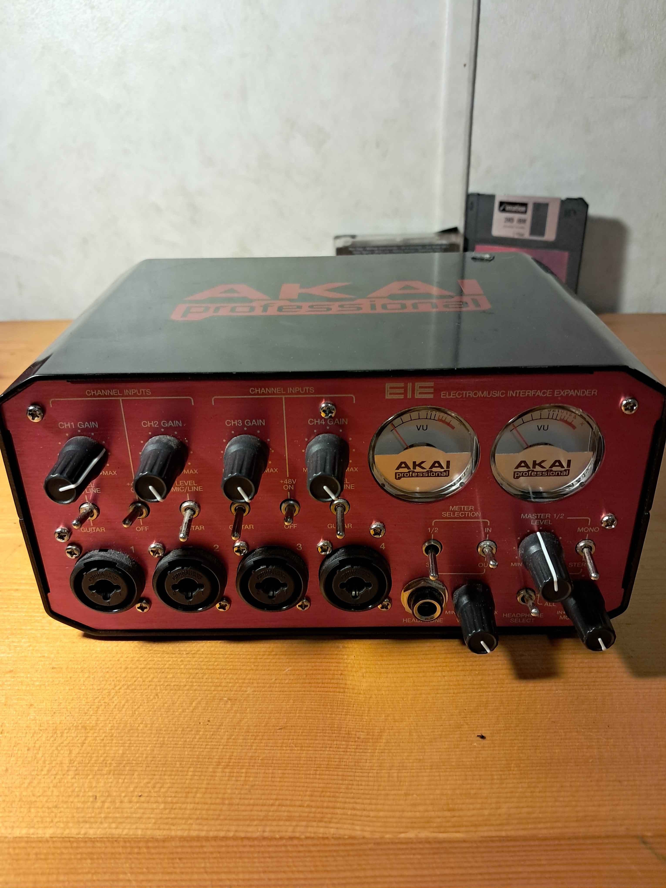

import { Image } from 'astro:assets';
import akai_eie_0 from '../assets/fixed/akai-eie/akai_eie_0.jpg';

# [Repair][USB_B_Female_Port]AKAI EIE

This is a repair log for repairing the USB type B female port located on the back of the interface.

## Rationale

Withthe difficulty of a job like this ona crucial piece of equipment for my setup I normally would not do this. But I have no other option and need this interface in 16 days from this date. I would reallystrongly prefer not to purchase something else. SoI boughtUSB type B femaleUSB connectors from AmazonHere's the one I bought

<!--  -->

<Image src={akai_eie_0} alt="akai_eie_0" />

<!-- link to the product -->

[USB Type B Female Port](https://www.amazon.com/gp/product/B07F9KWHQG/ref=ppx_yo_dt_b_asin_title_o00_s00?ie=UTF8&psc=1)

## Difficulty

Medium

## Components

- [x] AKAI EIE

## Tools

- [x] Phillips #2 Screwdriver
- [x] 6T star bit
- [x] Soldering iron
- [x] Desoldering pump
- [x] Needle nose pliers

## log

### Before

I like to take pictures of What I'm working with for reference. Unlike software, you can't easily see an exact previous state of The repair process.

### teardown

### Outer Case removal

I think that all I need to do is take the black case offand there are eight screws. I used a 6T star bit to remove the screws.

Now that all of the screws are removed, The top can easily be removed bypulling the lip on the front of the case up and off.

Using needle nose pliers, Carefully disconnect the three ribbon cablesbypulling up on either sideof the push connector.

Now unscrewthe 4smallerPhilip's head screws that are on either side of either side of the MIDI portsand then unscrew thelarger Phillips head screws on the other side. Either way you decide to take the screws off the board will fall free.

### Replacement

Image ofthe broken USB portwith the fixed one above it

Now let's carefullydesauder the six points of the connector

My soldering iron was not able to heat up enough to de solder the large joints

I bought asoldering iron returned it and then got the replacement.

Now it's time totake a desoldering pumpand heat up the solder on the board and remove the solder

Q: What is the ideal temperatureto set the song reaction to desolder and remove the joints?

A: https://www.build-electronic-circuits.com/right-soldering-temperature/
So somewhere between 200 and 400 degrees Celsius so in Fahrenheit that's between 392 and 752 degrees Fahrenheit. And then goes on to say you'll figure out you do it so let's figure it out.

I'm gonna set my soldering iron to644 degrees Celsius.
<small>Scotch tape makes a great heat sink </small>

    
Click to see the desoldered port

    This was very difficult for me and I had to come back to it several times over the course of a couple of days.After removing most of the saunter with the solid pointI then had to keep each individual pin and wiggle thebroken USB port free. I also destroyed the original USB port which I don't recommend.

I have put the board back in but don't wanna put the cover on becauseIf it's still broken I will not want to unscrew it again.

<!-- Pictureof theinterfacewithout its case on with the plugs in  -->

<!-- Picture of the ASIO for all configuration window -->

Success!

ASIO is reading my interface just like it did before.
Phew!

<!-- Final reassembled -->

### summary

And this blog post we tore down the Akai EIE and repaired the USB type B female port. We ran into some issues getting the old port off but were able to get it off and replace it with a new one.

I hope following thishas been helpful or entertaining :)
